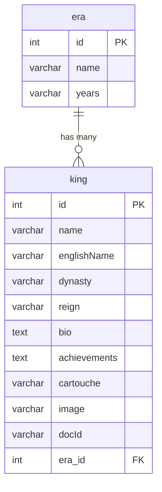

# Database Schema

Below is the database schema for the **HORUS Royal Archive** application, which connects to Supabase/PostgreSQL.

## Tables Detail

### 1. `era`
Stores the historical eras of Ancient Egypt.
- `id` (SERIAL, PK): Unique identifier for the era.
- `name` (VARCHAR(100), NOT NULL): Arabic name of the era (e.g., "الدولة القديمة").
- `years` (VARCHAR(100)): Time span of the era (e.g., "2686-2181 ق.م").

### 2. `king`
Stores details of the Pharaohs/Kings belonging to an era.
- `id` (SERIAL, PK): Unique identifier for the king.
- `name` (VARCHAR(100), NOT NULL): Arabic name of the pharaoh (e.g., "رمسيس الثاني").
- `englishName` (VARCHAR(100)): English name (e.g., "Ramesses II").
- `dynasty` (VARCHAR(100)): The dynasty number/period (e.g., "الأسرة 19").
- `reign` (VARCHAR(100)): Period of rule (e.g., "1279–1213 ق.م").
- `bio` (TEXT): Detailed biography of the pharaoh.
- `achievements` (TEXT): Newline-separated list of major achievements.
- `cartouche` (VARCHAR(100)): Hieroglyphic representations of their cartouche.
- `image` (VARCHAR(255)): File name of the uploaded portrait.
- `docId` (VARCHAR(50)): Associated YouTube/Google Doc identifier for media.
- `era_id` (INTEGER, FK): References `era.id` (ON DELETE SET NULL).
