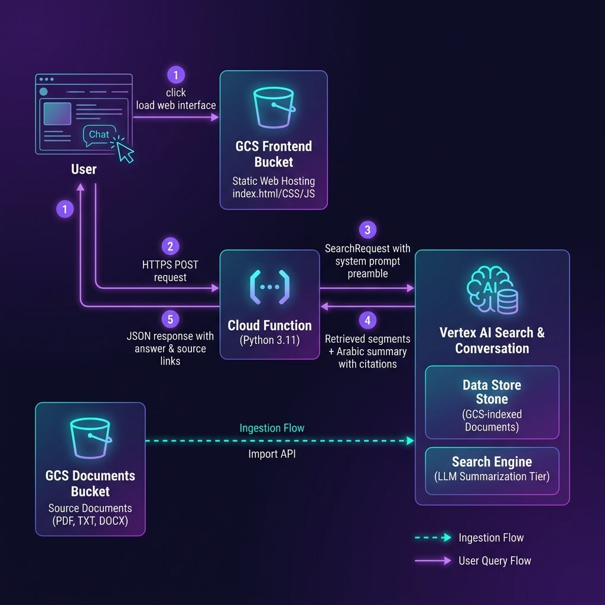

# GCP RAG Architecture - Horus Egypt Tourist Guide

A production-ready, serverless Retrieval-Augmented Generation (RAG) system deployed on **Google Cloud Platform (GCP)**. The system powers **Horus (حورس)**, an intelligent, warm, and highly engaging Arabic-speaking tour guide chatbot that answers user queries about Egypt's history, landmarks, culture, and culinary delights, referencing only verified documents.

---

## 🏗️ System Architecture & Workflow

Here is a visual overview of the system architecture, detailing both the **Document Ingestion Flow** and the **User Query Flow**:



---

## 🚀 Key Features

* **Arabic Persona (Horus)**: Integrated system prompt that styles responses to represent a knowledgeable, friendly, and welcoming Egyptian guide.
* **Pre-Query Interceptor**: Custom Python rules built into the API to filter impolite keywords, out-of-context requests (non-Egypt related), or short/unclear questions before calling the LLM, protecting budget and ensuring high-quality interactions.
* **Serverless Ingestion**: Multi-format document sync (PDF, TXT, DOCX, MD) via Python scripts directly into GCS and Vertex AI Search.
* **Citations & Sources**: Responses returned to the frontend include active citations, titles, snippets, and source links to verified files.
* **100% Infrastructure as Code**: Entire setup provisioned cleanly with reusable Terraform modules.

---

## 📂 Project Structure

```text
rag/
├── gcp/                            # GCP Infrastructure & Code
│   ├── backend/                    # Cloud Function API code
│   │   ├── main.py                 # Core query logic & interceptors
│   │   └── requirements.txt        # Python package dependencies
│   ├── frontend/                   # Frontend client files
│   │   ├── index.html              # Chat UI layout (Arabic)
│   │   ├── style.css               # Modern glassmorphism UI styling
│   │   ├── app.js                  # API fetch & messaging logic
│   │   └── config.js               # Auto-configured API endpoint
│   ├── modules/                    # Reusable Terraform modules
│   │   ├── api/                    # Cloud Function, IAM, Zip Archive
│   │   ├── frontend/               # GCS Static Website Bucket
│   │   └── vertex_search/          # GCS Docs Bucket, Data Store, Search Engine
│   ├── scripts/                    # Deployment & Ingestion scripts
│   │   ├── deploy_frontend.py      # Uploads static frontend assets to GCS
│   │   └── upload_docs.py          # Syncs documents and triggers Vertex AI Search
│   ├── main.tf                     # Root Terraform entrypoint
│   ├── variables.tf                # GCP Project & Region variables
│   └── outputs.tf                  # Infrastructure deployment outputs
├── docs/                           # Verified Egypt Knowledge Base documents
└── README.md                       # Documentation (This file)
```

---

## ⚙️ GCP Component Breakdown

### 1. Frontend Hosting (Google Cloud Storage)
- **Service**: Google Cloud Storage (GCS) Bucket.
- **Configuration**: Public static website hosting enabled with `index.html` as the default suffix and error page.
- **Access**: Standard `roles/storage.objectViewer` assigned to `allUsers`.
- **CORS**: Configured to support `GET`, `HEAD`, and `OPTIONS` from any origin (`*`).

### 2. API Layer (Gen 2 Cloud Function)
- **Service**: Google Cloud Run-backed Cloud Function (Gen 2).
- **Runtime**: `Python 3.11`.
- **Entrypoint**: `query_kb` (handles HTTP POST requests).
- **Security & IAM**:
  - Cloud Function runs under a custom Service Account (`gcp-rag-fn-sa`).
  - Granted `roles/discoveryengine.editor` to query the Vertex AI Search Data Store.
  - Configured for unauthenticated public invoker access (`roles/run.invoker` and `roles/cloudfunctions.invoker` assigned to `allUsers`).
- **Query Interceptor Logic (`main.py`)**:
  - **Impolite Language Interceptor**: Detects offensive words in Arabic and politely requests respectful communication.
  - **Context Lock**: Restricts the bot to Egypt-related topics only. If a user asks about anything else, Horus politely declines and redirects them back to Egypt.
  - **Clarification Handler**: Identifies empty or very short inputs and requests additional context.

### 3. Vector Database & Search (Vertex AI Search)
- **Service**: Vertex AI Search & Conversation (formerly Gen App Builder).
- **Components**:
  - **GCS Document Bucket**: Private GCS bucket for secure PDF, TXT, and DOCX source document storage.
  - **Data Store**: Configured as `SOLUTION_TYPE_SEARCH` using a `GENERIC` vertical, enabling advanced digital document parsing.
  - **Search Engine**: Configured as `SEARCH_TIER_ENTERPRISE` with the `SEARCH_ADD_ON_LLM` add-on enabled, providing high-fidelity, citation-grounded summaries using Google's foundational models.

---

## ⚡ Workflow & Execution Paths

### Ingestion Flow (Syncing Data)
1. **Upload**: User adds `.pdf`, `.txt`, `.docx`, or `.md` files to the local `/docs` folder.
2. **Pre-Processing**: The script converts Markdown `.md` files into clean `.txt` (`text/plain`) files, which Vertex AI Search fully supports.
3. **Storage Sync**: Documents are uploaded to the private GCS Documents bucket.
4. **Index Update**: The script triggers Vertex AI Search's Import API. The engine chunks, embeds, and indexes the documents asynchronously.

### User Query Flow (Chatting)
1. **Ask**: The user inputs a question in the Arabic chat interface.
2. **Post API**: The frontend sends an HTTPS `POST` request to the Cloud Function URL.
3. **Intercept & Check**: The Cloud Function checks the query against custom safety and context rules.
4. **Vertex AI Query**: The function triggers a Search Service Request to Vertex AI, passing the system prompt as a preamble to enforce Horus's persona.
5. **Summarize & Cite**: Vertex AI retrieves the relevant document chunks, runs them through the LLM summarization tier, and compiles a citation-grounded response.
6. **Respond**: The Cloud Function returns a JSON payload containing the Arabic answer, extractive snippets, and source document links back to the frontend.

---

## 🛠️ How to Deploy

### Prerequisites
- [Google Cloud SDK](https://cloud.google.com/sdk) authenticated to your GCP account.
- [Terraform CLI](https://developer.hashicorp.com/terraform/downloads) installed.
- Python 3.9+ with virtual environment configured.

### Step 1: Provision Infrastructure
Initialize and apply the Terraform configuration from the `gcp` directory:
```bash
cd gcp
terraform init
terraform apply
```
*Note: Make sure to review `variables.tf` and adjust the `project_id` (default: `gcp-ai-494313`) and `region` (default: `us-central1`) to match your settings.*

### Step 2: Upload Documents & Trigger Ingestion
Ingest the documents located in `/docs` to the Vertex AI Search Data Store:
```bash
python scripts/upload_docs.py
```
This script will upload files, trigger the asynchronous ingestion process, and wait for the import job to complete successfully.

### Step 3: Deploy Frontend Website
Inject the new Cloud Function URL into your frontend configuration and upload the static assets:
```bash
python scripts/deploy_frontend.py
```
After deployment, the script will output the public URL of your GCS-hosted Static Website frontend. Open the link to start chatting with **Horus**! 🇪🇬
