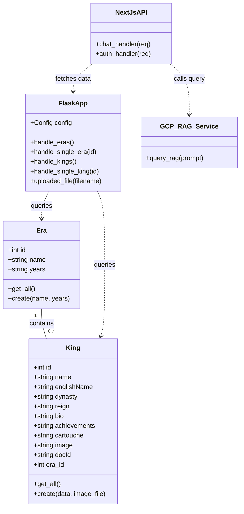
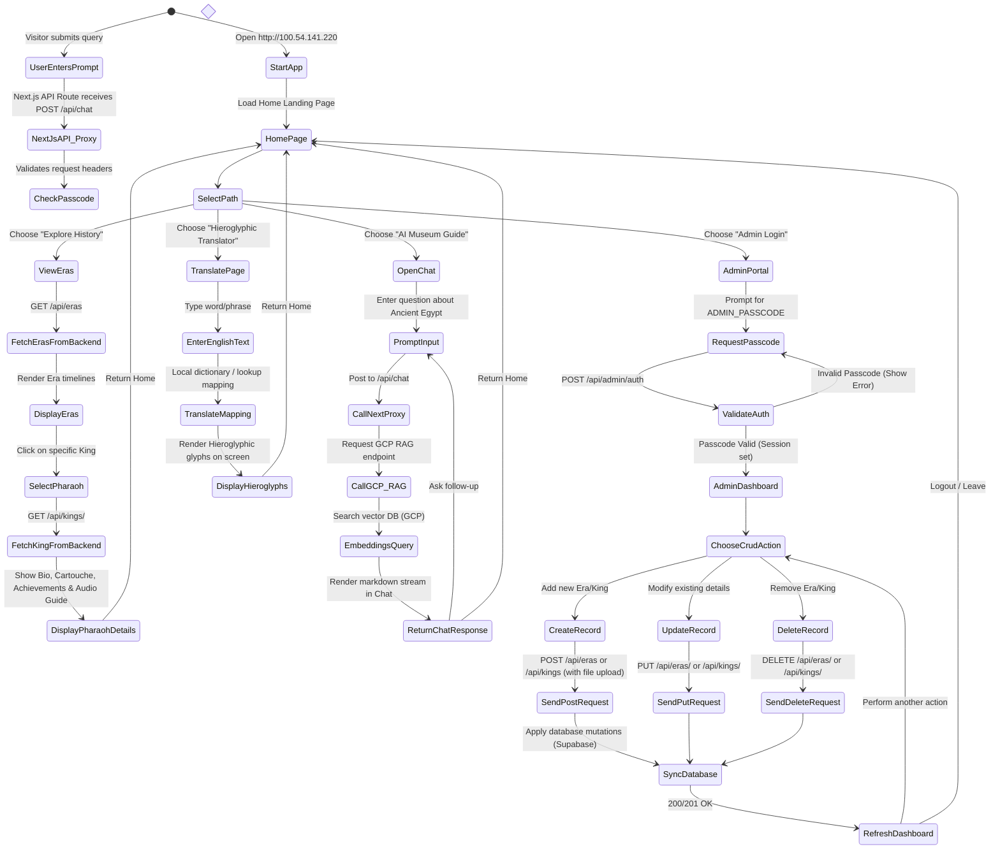
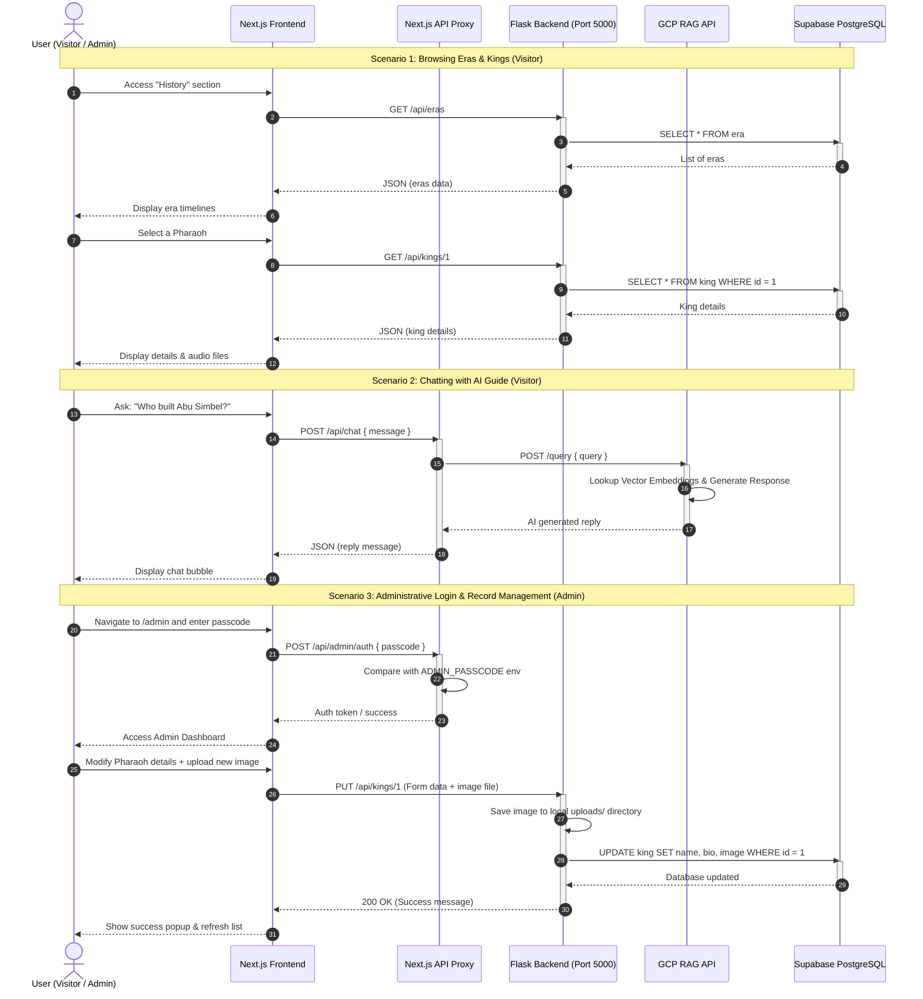

# UML Diagrams Reference (Mermaid)

This file contains the core UML diagrams mapping the structure, behavior, and use cases of the **Virtual Egyptian Museum (HORUS)** application.

---

## 1. Use Case Diagram
Describes the interactions between users (Visitor, Administrator) and the application features.

```mermaid
usecaseDiagram
    actor Visitor as "Normal Visitor"
    actor Admin as "Museum Administrator"

    rectangle "Virtual Egyptian Museum (HORUS)" {
        usecase UC1 as "Browse Eras & Kings"
        usecase UC2 as "Translate English to Hieroglyphics"
        usecase UC3 as "Chat with AI Museum Guide (RAG)"
        usecase UC4 as "Listen to Audio Guides"
        usecase UC5 as "Login to Admin Portal"
        usecase UC6 as "Manage Eras (Create/Edit/Delete)"
        usecase UC7 as "Manage Kings & Upload Media"
    }

    Visitor --> UC1
    Visitor --> UC2
    Visitor --> UC3
    Visitor --> UC4

    Admin --> UC5
    Admin --> UC6
    Admin --> UC7
    UC6 ..> UC5 : "<<include>>"
    UC7 ..> UC5 : "<<include>>"
```

---

## 2. Class Diagram
Represents the system's static structure, models, APIs, and controller layers.



---

## 3. Activity Diagram (RAG Chat Flow)
Illustrates the step-by-step workflow when a visitor queries the AI Museum Guide.



---

## 4. Global Sequence Diagram
Details the sequence of message exchanges across all subsystems (Visitor, Administrator, Next.js Frontend, Flask API Backend, GCP RAG API, and Supabase PostgreSQL Database).



